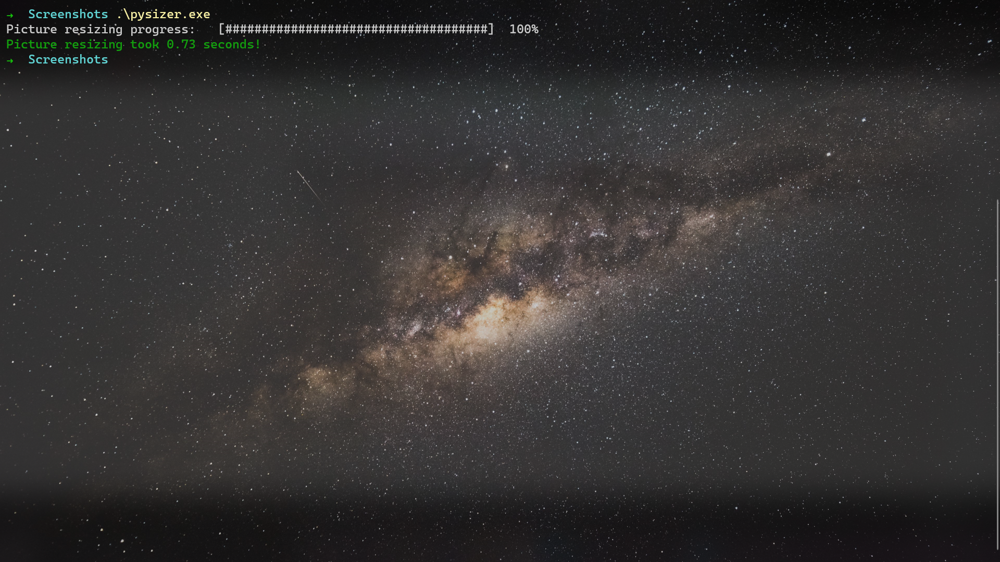

# PySizer

# Introduction

### PySizer is a simple python command line program to resize images efficiently using Threads. This program uses click as a command line argument parser. It can also be used to pyinstaller to create a executable.

# Quick Start

- Install dependencies

```bash
pip install -r requirements.txt
```

- Create executable

```bash
pyinstaller --onefile ./pysizer/pysizer.py
```

- Get Help

```bash
$ python .\pysizer.py --help
Usage: pysizer.py [OPTIONS]

  Main PySizer function which with ThreadPoolExecutor creates threads for
  resizing pictures.

  Checks for correct file extension, creates threads for each picture with
  thread limitation as given by threads argument.

  Creates progress bar with the click for resizing progress.

  :param folder: the picture's folder path :param dest: the resized pictures
  destination path :param height: the resized picture's height :param width:
  the resized picture's width

Options:
  --folder PATH      pictures folder path  [default: .; required]
  --dest PATH        destination for resized pictures  [default: resized;
                     required]

  --height INTEGER   image height in px  [default: 1920; required]
  --width INTEGER    image width in px  [default: 1280; required]
  --threads INTEGER  number of threads to use  [default: 50]
  --help             Show this message and exit.
```

# Demo



# Project Made and Maintained By Kumar Aditya
